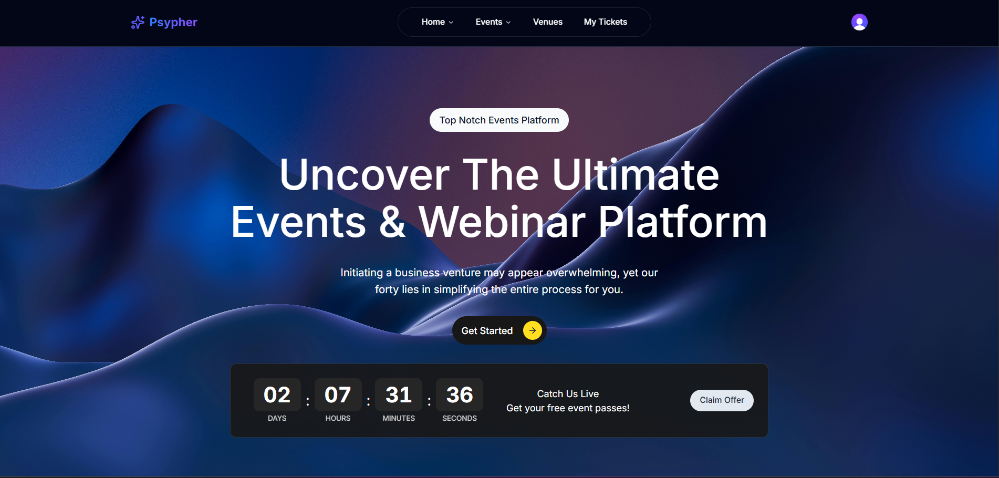

# Psypher App

## 🚀 Brief Information

Psypher App is a modern web application built with **Next.js** that serves as a platform for discovering and managing events, users, and venues. It leverages **Supabase** for backend services and **Clerk** for authentication, providing a seamless experience for users to explore events, manage profiles, and interact with venues.

## 🌐 Live Project

Check out the live app here: 🎬[https://psypher-events.vercel.app/](https://psypher-events.vercel.app/)

## Project Preview



---

## 📂 Project Structure

```bash
psypher-app/
├── src/                   # Source folder for app logic and components
│   ├── app/               # Next.js App Router
│   │   ├── api/           # API routes
│   │   ├── events/        # Events page for browsing & viewing event details
│   │   ├── not-found.tsx  # Custom 404 page for handling unmatched routes
│   ├── components/        # Reusable components (UI, layout, etc.)
│   │   ├── layout/        # Layout-specific components like header, footer etc.
│   │   ├── theme/         # Theme management & toggling components (light/dark)
│   │   ├── ui/            # ShadCn UI & custom components like countdowns, filters etc.
│   │   ├── cards/         # Cards used for event/venue/user previews
│   │   ├── custom/        # Any custom-built widgets or utilities
│   ├── lib/               # Utility functions (db, helpers, actions)
│   ├── types/             # Custom TypeScript types
│   ├── hooks/             # Reusable React hooks
│   ├── constants/         # Application-wide constants
│   └── services/          # API call services using Axios
├── middleware.ts          # Clerk + RLS middleware
├── public/                # Static assets
├── tsconfig.json          # TypeScript configuration
└── .env.local             # Environment variables
```

---

## ⚙️ Installation Guide

To set up the project locally, follow these steps:

1. **Clone the repository**:

```bash
git clone https://github.com/imtiaj-007/Psypher-Events
cd psypher-app
```

2. **Install dependencies**:

```bash
npm install
```

---

## 🔐 Environment Setup

Create a `.env.local` file in the root directory and add the following variables:

```bash
NEXT_PUBLIC_CLERK_PUBLISHABLE_KEY=your_clerk_publishable_key
CLERK_SECRET_KEY=your_clerk_secret_key

NEXT_PUBLIC_SUPABASE_URL=your_supabase_url
NEXT_PUBLIC_SUPABASE_ANON_KEY=your_supabase_anon_key
```

Make sure to replace placeholders with actual values from your Supabase and Clerk projects.

---

## 👤 Demo User Accounts

For testing and checking portal functionalities use these test accounts:

```bash
email: user1@psypher.com    # Platinum User
password: Psypher-1

email: user2@psypher.com    # Gold User
password: Psypher-2

email: user3@psypher.com    # Silver User
password: Psypher-3

email: user4@psypher.com    # Free User
password: Psypher-4
```

---

## 📑 SQL Queries

```sql
-- 1. Create tier enum
CREATE TYPE IF NOT EXISTS tier AS ENUM ('free', 'silver', 'gold', 'platinum');

-- 2. Create events table
CREATE TABLE IF NOT EXISTS events (
    id UUID PRIMARY KEY DEFAULT gen_random_uuid(),
    title TEXT NOT NULL,
    description TEXT,
    event_date TIMESTAMPTZ NOT NULL,
    thumbnail TEXT,
    tier tier NOT NULL,
    external_link TEXT,
    created_at TIMESTAMPTZ DEFAULT NOW(),
    updated_at TIMESTAMPTZ
);

-- 3. Enable RLS on table events and tickets
ALTER TABLE events ENABLE ROW LEVEL SECURITY;

-- 4. Create a user access function
CREATE OR REPLACE FUNCTION user_can_access_event(event_tier tier, user_tier tier)
RETURNS BOOLEAN AS $$
BEGIN
    RETURN
        CASE user_tier
            WHEN 'platinum' THEN TRUE
            WHEN 'gold'     THEN event_tier IN ('free', 'silver', 'gold')
            WHEN 'silver'   THEN event_tier IN ('free', 'silver')
            WHEN 'free'     THEN event_tier = 'free'
            ELSE FALSE
        END;
END;
$$ LANGUAGE plpgsql;

-- 5. Create RLS View policy on events
CREATE POLICY "allow_access_based_on_clerk_tier"
ON events
FOR SELECT
USING (
    user_can_access_event(
        events.tier, 
        COALESCE(
            NULLIF(TRIM(auth.jwt() ->> 'tier'), '')::tier,
            'free'::tier
        )
    )
);

```

For detailed SQL queries and schema definitions, please see: 🔗[Psypher SQL Queries](./src/lib/supabase/queries.sql)

---

## 🧪 Testing

To run tests:

```bash
npm test
```

Ensure testing libraries (e.g. Cypress, Jest) are installed and configured.

> **Note**: Automated testing is not set up yet. You are encouraged to configure your preferred testing tools and add test suites to ensure code quality.

---

## 📚 Documentation

* **API Documentation**: [API Docs](link_to_api_docs)
* **Frontend Guide**: [Frontend Docs](link_to_frontend_docs)


> **Note**: Live documentation preview is coming soon. In the meantime, refer to the TSDoc comments within each file for detailed documentation.

---

## 💻 Tech Stack

* [x] **Next.js** — App Router
* [x] **TypeScript** — Type Safety
* [x] **Supabase** — Realtime DB, RLS
* [x] **Clerk** — Authentication & User Management
* [x] **Tailwind CSS** — Styling
* [x] **ShadCN UI** — Component Library

---


## 📄 License

This project is licensed under the MIT License. See the [LICENSE](LICENSE) file for details.

---

## 📬 Contact

For any inquiries or feedback, reach out at 📬[imtiaj_mock_email@example.com](mailto:imtiaj.kol@gmail.com)
